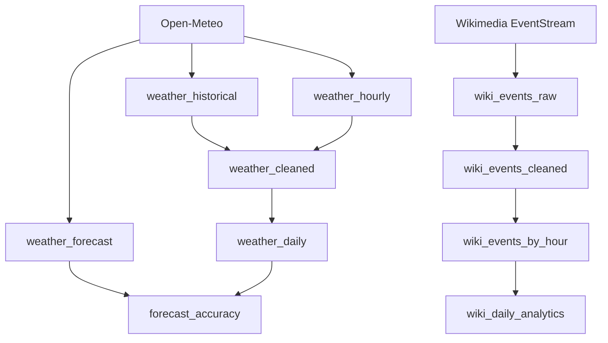

# Dagster Pipeline

A Dagster data engineering demo project using real public APIs:

- **Open-Meteo** — weather forecast, historical, and hourly time-series data
- **Wikimedia EventStreams** — streaming event ingestion

## Quick Start

```bash
git clone <repo-url>
cd dagster-pipeline

cp .env.example .env
pip install -e ".[dev]"
dagster dev
```

Open [http://localhost:3000](http://localhost:3000) in your browser.

## Architecture

Two independent pipelines converge in a single Dagster asset graph:



### Weather pipeline

`weather_historical` and `weather_hourly` pull real data from Open-Meteo, are
cleaned into `weather_cleaned`, aggregated into `weather_daily`, and compared
against the forecast in `forecast_accuracy`.

### Wiki pipeline

`wiki_events_raw` ingests Wikimedia EventStreams (SSE), then `wiki_events_cleaned`
deduplicates and validates, `wiki_events_by_hour` aggregates hourly, and
`wiki_daily_analytics` produces daily summaries.

## Materialize Assets

```python
# In Dagster UI: click an asset and select "Materialize"
# Or via CLI:
dagster asset materialize --asset-key weather_historical
dagster asset materialize --asset-key weather_hourly
dagster asset materialize --asset-key weather_forecast
```

## Backfill

```bash
dagster asset backfill --asset-key weather_historical --partition-start 2026-01-01 --partition-end 2026-01-31
```

## Schedule

`weather_daily_schedule` runs daily at 23:00 UTC, materializing the weather
partition for each day.

## Sensor

`wikimedia_event_sensor` monitors Wikimedia EventStreams and triggers
materialization when new events arrive, using a cursor
(`last_processed_event_id`, `last_processed_timestamp`) for bounded,
incremental processing.

## Testing

```bash
pytest
```

All tests run offline using mocked API responses.